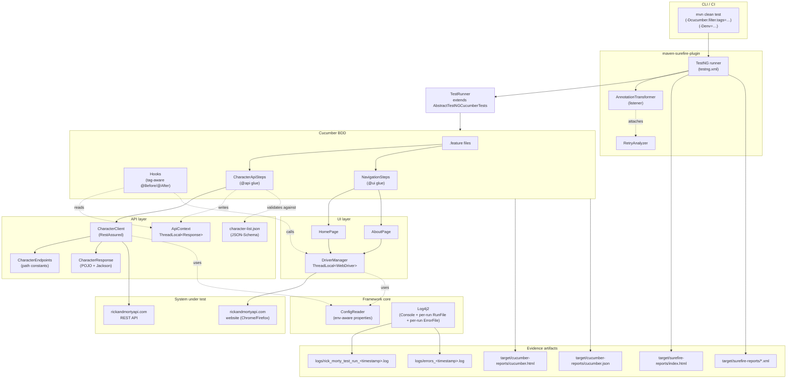

# Rick & Morty Automation Framework

Hybrid **API + UI** test-automation framework for the [Rick and Morty API](https://rickandmortyapi.com/) using **Selenium WebDriver**, **RestAssured**, and **Cucumber** BDD on **TestNG**, with **Log4j2** logging and JSON-Schema contract validation.

---

## Table of Contents
1. [Project Structure](#1-project-structure)
2. [Workflow / Component Diagram](#2-workflow--component-diagram)
3. [Use Cases Covered](#3-use-cases-covered)
4. [Workspace Setup & Execution](#4-workspace-setup--execution)
5. [Validation Report](#5-validation-report)

---

## 1. Project Structure

```
rick-morty-automation-framework/
├── pom.xml                                  # Maven build, deps, surefire config
├── testng.xml                               # TestNG suite + AnnotationTransformer listener
├── README.md
├── logs/                                    # Per-run Log4j2 output (one file per mvn invocation)
│   ├── rick_morty_test_run_<timestamp>.log  # Full trace
│   └── errors_<timestamp>.log               # ERROR-level only
│
├── src/main/java/com/rickandmorty/
│   ├── api/
│   │   ├── clients/CharacterClient.java     # RestAssured wrapper, request/response logging
│   │   ├── endpoints/CharacterEndpoints.java# Path constants (single source of truth)
│   │   ├── models/CharacterResponse.java    # Lombok @Data POJO
│   │   └── context/ApiContext.java          # ThreadLocal holder (Hooks reads on failure)
│   ├── ui/
│   │   └── pages/                           # Page-Object Model
│   │       ├── HomePage.java
│   │       └── AboutPage.java
│   └── utils/
│       ├── config/ConfigReader.java         # Multi-env properties loader
│       ├── data/TestDataReader.java         # Jackson JSON reader — framework utility (kept for future data-driven steps)
│       ├── driver/DriverManager.java        # ThreadLocal<WebDriver>, browser/headless switch
│       └── testng/
│           ├── RetryAnalyzer.java           # IRetryAnalyzer — retries each failed test once
│           └── AnnotationTransformer.java   # IAnnotationTransformer — auto-applies retry
│
└── src/test/
    ├── java/com/rickandmorty/
    │   ├── runners/TestRunner.java          # AbstractTestNGCucumberTests
    │   └── stepdefinitions/
    │       ├── api/CharacterApiSteps.java   # @api glue (logged per step)
    │       ├── ui/NavigationSteps.java      # @ui glue (logged per step)
    │       └── hooks/Hooks.java             # tag-aware @Before/@After
    └── resources/
        ├── config/
        │   ├── log4j2.xml                   # Console + per-run RunFile + per-run ErrorFile appenders
        │   ├── qa.properties                # default env
        │   ├── staging.properties
        │   ├── preprod.properties
        │   └── prod.properties
        ├── features/
        │   ├── api_character.feature        # 3 @api scenarios
        │   └── navigation.feature           # 1 @ui @smoke scenario
        ├── schemas/
        │   └── character-list.json          # JSON-Schema (draft-07) for /character response
        └── testdata/
            └── ui-data.json                 # Test-data manifest (currently informational; route here when data variety grows)
```

---

## 2. Workflow / Component Diagram



### How a test flows

1. **`mvn clean test`** invokes `maven-surefire-plugin`, which loads `testng.xml`.
2. **TestNG** sees the `AnnotationTransformer` listener and attaches `RetryAnalyzer` to every `@Test` method (i.e. every Cucumber scenario via `AbstractTestNGCucumberTests.runScenario`).
3. **`TestRunner`** is the only TestNG class — its `@DataProvider` produces one Cucumber pickle per scenario.
4. For each scenario, **`Hooks.@Before`** logs the banner; tag-aware **`@After`** decides what to attach on failure (screenshot for `@ui`, request/response context for `@api`) and quits the WebDriver only when a UI driver was created.
5. Step definitions delegate to the **API client** or **Page Objects**, which use **`ConfigReader`** for env-aware URLs and **`DriverManager`** for thread-safe browsers.
6. **Log4j2** captures everything to console + rolling files; **Cucumber** writes HTML/JSON; **TestNG** writes the Surefire reports.

---

## 3. Use Cases Covered

### 3.1 API — `@api` (3 scenarios)

| # | Scenario | Endpoint | Expected | Validations |
|---|---|---|---|---|
| 1 | Search characters by name | `GET /character?name=rick` | 200 | (a) status 200 (b) results contain "Rick" (c) **JSON-Schema** validation against `character-list.json` |
| 2 | Handle invalid character ID | `GET /character/99999` | 404 | status 404, body `error == "Character not found"` |
| 3 | Search returns no matches | `GET /character?name=zzzzznotreal` | 404 | status 404, body `error == "There is nothing here"` |

### 3.2 UI — `@ui @smoke` (1 scenario)

| # | Scenario | Validations |
|---|---|---|
| 1 | About page contains author information | (a) Click "About" in nav (b) URL contains `/about` (waited via `urlContains`) (c) Technical heading visible (d) Author "Axel Fuhrmann" rendered on page |

### 3.3 Cross-cutting framework capabilities

- **Multi-environment** — `qa` (default), `staging`, `preprod`, `prod` selected via `-Denv=...`.
- **Multi-browser** — `chrome` / `firefox`, optionally headless, configured per env.
- **Tag-filtered runs** — `@api`, `@ui`, `@smoke`, or boolean expressions (`@api and not @smoke`).
- **Auto-retry of flaky scenarios** — every test gets a `RetryAnalyzer` automatically (no per-method annotation needed).
- **Parallel-safe** — `ThreadLocal<WebDriver>` and `ThreadLocal<Response>` (ApiContext) make concurrent scenarios safe.
- **Failure-context attachments** — UI failures embed PNG screenshots in the Cucumber HTML report; API failures embed the request endpoint, status code, latency, and full response body.
- **Externalized API contract** — `schemas/character-list.json` documents the expected response shape; runtime validation catches upstream drift.

---

## 4. Workspace Setup & Execution

### 4.1 Prerequisites

| Tool | Version | Notes |
|---|---|---|
| Java | **11+** | `java -version` to verify |
| Maven | **3.8+** | `mvn -v` |
| Chrome | latest | WebDriverManager auto-fetches the matching driver |
| Firefox | optional | only required when `browser=firefox` |
| Internet access | yes | needed for `rickandmortyapi.com` and Maven Central |

### 4.2 Clone & install

```bash
git clone <repo-url>
cd rick-morty-automation-framework
mvn -s settings.xml clean install -DskipTests
```

`-DskipTests` just resolves the dependency tree without actually executing tests — useful on first checkout.

### 4.3 Maven settings (`-s settings.xml`)

The project ships a **project-local `settings.xml`** that pins all dependency lookups to the public **Maven Central** repository (`https://repo1.maven.org/maven2`). Use it via the `-s` flag on every `mvn` invocation:

```bash
mvn -s settings.xml <goals>
```

**Why this matters:** if your `~/.m2/settings.xml` contains a `<mirror>` pointing to a corporate / private registry (e.g. GitHub Packages), Maven will route *all* Central traffic through that mirror — and dependency downloads will fail with `401 Unauthorized` if you aren't authenticated to it. The `-s settings.xml` flag tells Maven to use this project's settings instead, bypassing the user-level mirror.

**Skip-the-flag option:** create `.mvn/maven.config` with the line `-s settings.xml` (Maven 3.3.1+). Then plain `mvn …` automatically applies the flag inside this project. Outside the project (or in CI without that file), you'd still pass `-s` explicitly.

### 4.4 Configuration

Per-environment properties live under `src/test/resources/config/`:

| Key | Example | Used by |
|---|---|---|
| `browser` | `chrome` / `firefox` | `DriverManager` |
| `headless` | `true` / `false` | `DriverManager` |
| `baseUrl` | `https://rickandmortyapi.com/` | `NavigationSteps` (UI home) |
| `apiBaseUrl` | `https://rickandmortyapi.com/api/` | `CharacterClient` |
| `timeout` | `10` | reserved for explicit waits |

The active env is chosen by `-Denv=<name>` (default: `qa`).

### 4.5 Running tests

```bash
# All tests (UI + API)
mvn -s settings.xml clean test

# API only (no browser launched)
mvn -s settings.xml clean test -Dcucumber.filter.tags='@api'

# UI smoke only
mvn -s settings.xml clean test -Dcucumber.filter.tags='@ui and @smoke'

# Everything except UI (CI without a display)
mvn -s settings.xml clean test -Dcucumber.filter.tags='not @ui'

# Different env
mvn -s settings.xml clean test -Denv=staging

# Run a single scenario by name
mvn -s settings.xml clean test -Dcucumber.filter.name='Search characters by name'
```

> **Note:** `browser` and `headless` are read from the active properties file. To override at the CLI, change those properties in the file (or wire `System.getProperty(...)` into `DriverManager` if you'd like CLI overrides).

### 4.6 Parallelism

Surefire is pre-configured with overridable knobs in `pom.xml` properties:

```bash
mvn -s settings.xml test -DforkCount=2 -DthreadCount=4 -DdataProviderThreadCount=4
```

To actually run scenarios in parallel, also flip `@DataProvider(parallel = true)` in `TestRunner.java`.

### 4.7 Generated artifacts

| Artifact | Location | What's in it |
|---|---|---|
| Cucumber HTML | `target/cucumber-reports/cucumber.html` | Steps, durations, embedded screenshots (UI) and API failure context |
| Cucumber JSON | `target/cucumber-reports/cucumber.json` | Machine-readable for CI dashboards |
| TestNG HTML index | `target/surefire-reports/index.html` | TestNG-style suite report |
| TestNG XML | `target/surefire-reports/TEST-TestSuite.xml` | JUnit-compatible XML for CI |
| Suite summary | `target/surefire-reports/TestSuite.txt` | One-liner: `Tests run: N, Failures: 0…` |
| Application log | `logs/rick_morty_test_run_<timestamp>.log` | Full request/response trail, scenario banners — fresh file per run |
| Error log | `logs/errors_<timestamp>.log` | ERROR-level only (for monitoring/alerting) — fresh file per run, same `<timestamp>` as the run log |

### 4.8 Console output

`mvn` stdout shows Cucumber's pretty-printed step trace plus Log4j2 timestamped lines. Capture for review:

```bash
mvn -s settings.xml clean test | tee run.log
```

### 4.9 Logging

The framework writes a **fresh log file per run** (no rolling/overwrite) so that every `mvn` invocation produces a self-contained, archivable log. Two files are created per run, sharing the same `<timestamp>` suffix:

```
logs/
├── rick_morty_test_run_<timestamp>.log   # full trace: request/response, scenario banners, all levels DEBUG+
└── errors_<timestamp>.log                # ERROR-level only — empty file when nothing failed
```

Example after two consecutive runs:
```
logs/
├── rick_morty_test_run_2026-05-14_13-08-28.log
├── errors_2026-05-14_13-08-28.log
├── rick_morty_test_run_2026-05-14_13-08-49.log
└── errors_2026-05-14_13-08-49.log
```

**How the timestamp is shared between the two files**

Maven exposes its build start time as `${maven.build.timestamp}` (formatted via `<maven.build.timestamp.format>` in `pom.xml`). Surefire forwards it as a system property:

```xml
<!-- pom.xml -->
<maven.build.timestamp.format>yyyy-MM-dd_HH-mm-ss</maven.build.timestamp.format>
…
<systemPropertyVariables>
    <run.timestamp>${maven.build.timestamp}</run.timestamp>
</systemPropertyVariables>
```

`log4j2.xml` reads it (with a Log4j `${date:…}` lookup as a fallback for non-Maven runs):

```xml
<Property name="RUN_TIMESTAMP">${sys:run.timestamp:-${date:yyyy-MM-dd_HH-mm-ss}}</Property>
<Property name="LOG_FILE">${LOG_DIR}/rick_morty_test_run_${RUN_TIMESTAMP}.log</Property>
<Property name="ERROR_LOG_FILE">${LOG_DIR}/errors_${RUN_TIMESTAMP}.log</Property>
```

Both `<File>` appenders read the same `RUN_TIMESTAMP` property, so the run log and error log always pair up by name.

**Appenders**

| Appender | Target | Filter |
|---|---|---|
| `Console` | stdout (`SYSTEM_OUT`) | none — everything per logger level |
| `RunFile` | `logs/rick_morty_test_run_<timestamp>.log`, `append=false` | none |
| `ErrorFile` | `logs/errors_<timestamp>.log`, `append=false` | `ThresholdFilter level=ERROR` |

**Logger levels** (in `log4j2.xml`):

| Logger | Level | Notes |
|---|---|---|
| `com.rickandmorty` | `DEBUG` | Framework code — full trace |
| `org.openqa.selenium` | `WARN` | Selenium internals |
| `io.restassured` | `INFO` | RestAssured filters |
| `org.apache.http` | `WARN` | Apache HTTP client |
| `io.cucumber` | `INFO` | Cucumber engine |
| Root | `INFO` | Catch-all |

**Note on time zone** — Maven's build timestamp is **UTC** by default. Wall-clock 18:38 IST appears as `13-08` (UTC) in the filename. This is canonical and timezone-portable; if you'd rather see local time, drop the `${sys:run.timestamp}` part of the lookup so Log4j's `${date:…}` (local time) takes over.

---

## 5. Validation Report

### 5.1 Technical requirements

| Requirement | Required | Project | Status |
|---|---|---|---|
| Java | 11+ | `<source>11</source>`, `<target>11</target>` (`pom.xml`) | ✅ |
| Build tool | Maven | `pom.xml` with surefire, compiler plugins | ✅ |
| UI automation | Selenium WebDriver | `selenium-java:4.21.0` + `webdrivermanager:5.8.0` | ✅ |
| BDD | Cucumber | `cucumber-java`, `cucumber-testng`, `cucumber-picocontainer` (7.15.0) | ✅ |
| API testing | Java HTTP client (RestAssured recommended) | `rest-assured:5.4.0` + `json-schema-validator` | ✅ |
| Test framework | JUnit / TestNG | `testng:7.9.0`, suite at `testng.xml` | ✅ |

### 5.2 Deliverable 1 — Complete Maven Project ✅

- Standard Maven layout: `src/main/java`, `src/test/java`, `src/test/resources`.
- `pom.xml` with all required dependencies; `maven-surefire-plugin` configured (TestNG suite, parallel knobs, log4j config, system-property variables).
- `testng.xml` registers `AnnotationTransformer` listener (auto-applies `RetryAnalyzer` to every test).
- Multi-env config: `qa.properties` (default), `staging.properties`, `preprod.properties`, `prod.properties`.

### 5.3 Deliverable 2 — Feature Files ✅

Located in `src/test/resources/features/`:

- **`api_character.feature`** (3 scenarios under `@api`)
  - Search characters by name → 200 + name match + JSON-Schema validation
  - Handle invalid character ID (`99999`) → 404 + error message
  - Search returns no matches (`zzzzznotreal`) → 404 + `"There is nothing here"`
- **`navigation.feature`** (1 scenario under `@ui @smoke`)
  - About-page redirect + Technical section + author "Axel Fuhrmann" rendered on page

### 5.4 Deliverable 3 — Java Implementation ✅

| Class | Responsibility |
|---|---|
| `api/clients/CharacterClient` | RestAssured wrapper, config-driven base URL, request/response logging |
| `api/endpoints/CharacterEndpoints` | Single source of truth for paths |
| `api/models/CharacterResponse` | Lombok `@Data` POJO, Jackson `@JsonIgnoreProperties` |
| `api/context/ApiContext` | ThreadLocal holder so Hooks can attach last response on failure |
| `ui/pages/HomePage`, `AboutPage` | Page-Object Model with explicit waits (`urlContains`, `visibilityOf…`) |
| `utils/config/ConfigReader` | Env-aware properties loader, default-value overload |
| `utils/data/TestDataReader` | Jackson JSON reader — framework utility (kept for future data-driven steps) |
| `utils/driver/DriverManager` | `ThreadLocal<WebDriver>`, switch on `browser` + `headless` |
| `utils/testng/RetryAnalyzer` | `IRetryAnalyzer`, retries each failed test once |
| `utils/testng/AnnotationTransformer` | `IAnnotationTransformer`, auto-attaches retry to every `@Test` |
| `runners/TestRunner` | Extends `AbstractTestNGCucumberTests`, parallel-ready `@DataProvider` |
| `stepdefinitions/{api,ui}/*Steps` | Cucumber glue, log4j logged per step |
| `stepdefinitions/hooks/Hooks` | `@Before`/`@After`: tag-aware screenshots (UI) + API context attachment |

### 5.5 Deliverable 4 — Execution Evidence ✅

Last full run (`mvn clean test`, 2026-05-14 17:55):
> **Tests run: 4, Failures: 0, Errors: 0** in 6.67 s

| Artifact | Path | Size |
|---|---|---|
| Cucumber HTML report | `target/cucumber-reports/cucumber.html` | ~2.0 MB |
| Cucumber JSON report | `target/cucumber-reports/cucumber.json` | 7 KB |
| TestNG HTML index | `target/surefire-reports/index.html` | 19 KB |
| TestNG emailable | `target/surefire-reports/emailable-report.html` | 3 KB |
| Surefire XML | `target/surefire-reports/TEST-TestSuite.xml` | 56 KB |
| TestNG results XML | `target/surefire-reports/testng-results.xml` | 5 KB |
| Suite summary | `target/surefire-reports/TestSuite.txt` | one-line status |
| Application log | `logs/rick_morty_test_run_<timestamp>.log` | Full request/response trail, scenario banners — fresh file per run |
| Error log | `logs/errors_<timestamp>.log` | ERROR-level only — fresh file per run, paired with the run log via shared timestamp |

**Screenshots** — `Hooks.attachScreenshot(...)` captures the browser as PNG and embeds it in `cucumber.html` whenever a `@ui` scenario fails.
**Console output** — `mvn` stdout shows the Cucumber pretty-printed step trace plus log4j2 timestamps. Capture with `mvn clean test | tee run.log`.

### 5.6 Beyond the spec

- **JSON-Schema contract validation** (`schemas/character-list.json`) — catches upstream API drift.
- **RetryAnalyzer + AnnotationTransformer** — auto-retries flaky scenarios once.
- **Multi-browser, multi-headless** via `browser` + `headless` properties (Chrome / Firefox).
- **Multi-env** (`-Denv=qa|staging|preprod|prod`).
- **Tag-filtered runs** (`-Dcucumber.filter.tags='@api'`).
- **ThreadLocal driver + ApiContext** — parallel-safe.
- **Log4j2** with **per-run timestamped log files** (`rick_morty_test_run_<timestamp>.log` + `errors_<timestamp>.log`) — every `mvn` invocation produces a self-contained, archivable log pair.
- **Cucumber tag-aware Hooks** — UI gets screenshot + driver-quit; API gets request/response context attachment.

### 5.7 Verdict

All assignment requirements + all deliverables are present and verified by a passing run. The framework also includes several production-quality extras (retry, parallel safety, schema validation, multi-env, tag-aware hooks) that go beyond the rubric.
